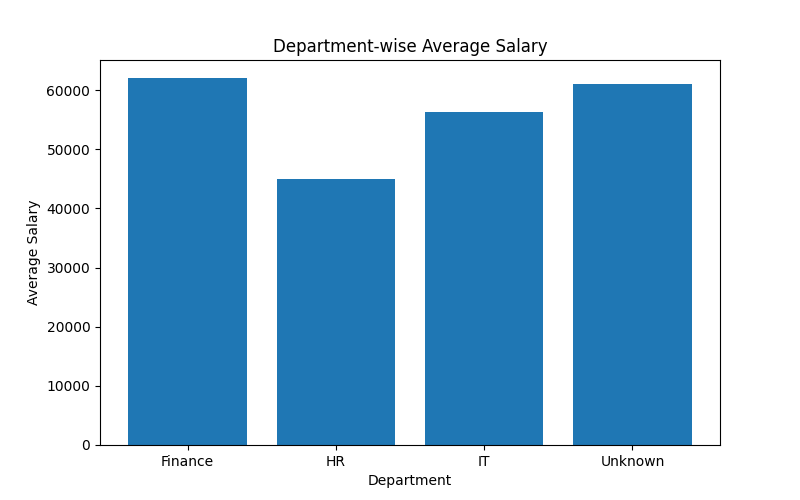
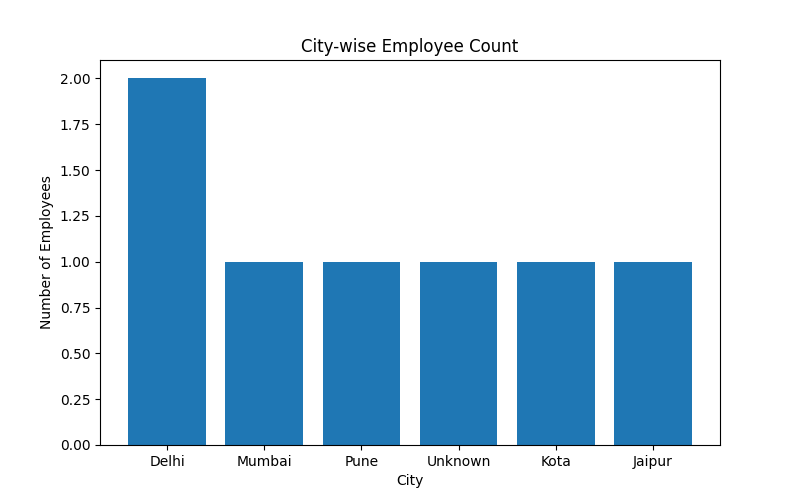
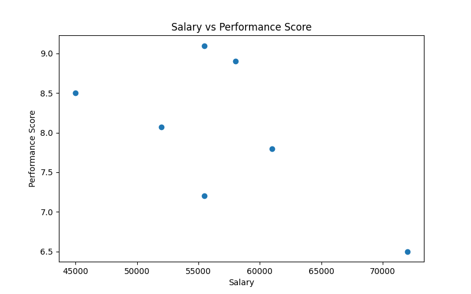

# Employee Analytics Project

## Overview

This project analyzes employee data using Python, Pandas, and Matplotlib.  
It focuses on real-world employee analytics including data cleaning, duplicate handling, salary analysis, performance analysis, and visualization generation.

The project demonstrates a complete beginner-to-intermediate level data analytics workflow.

---

## Project Structure

* `data/` → employee dataset (CSV file)
* `visuals/` → saved graphs and charts
* `analysis.py` → main analysis script
* `insights.txt` → key business findings
* `README.md` → project documentation

---

## Data Cleaning Performed

* Missing value handling using `fillna()`
* Duplicate employee record removal using `drop_duplicates()`
* Data type inspection using `dtypes`
* Data type conversion using `astype()`

---

## Analysis Performed

* Average salary analysis
* Highest and lowest salary identification
* Department-wise salary analysis
* City-wise employee distribution
* Top paid employees analysis
* Salary vs Performance relationship analysis
* Employee experience distribution
* Department performance comparison

---

## Visualizations

* Bar charts (department salary analysis)
* Employee distribution charts
* Histogram (performance & experience distribution)
* Scatter plot (salary vs performance)
* Pie chart (department employee distribution)

---

## Key Insights

* IT department shows strong average salary trends.
* Delhi has one of the highest employee counts.
* Duplicate employee records were successfully cleaned.
* Most employees fall within medium-to-high performance ranges.
* Salary and performance show positive relationship patterns.
* Department-wise analysis helps compare workforce distribution effectively.

---

## Sample Visualizations

---

## Tools Used

* Python
* Pandas
* Matplotlib

---

## Outcome

This project demonstrates practical usage of:
- Data Cleaning
- Missing Value Handling
- Duplicate Handling
- Data Type Conversion
- GroupBy Analysis
- Aggregation
- Sorting
- Data Visualization
- Business Insight Generation

It forms a complete employee analytics workflow using Pandas and Matplotlib.

---

## Author

**Mehul Sharma**  
Aspiring Data Scientist