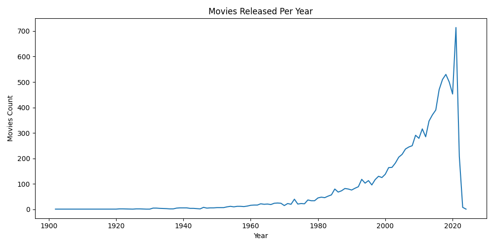
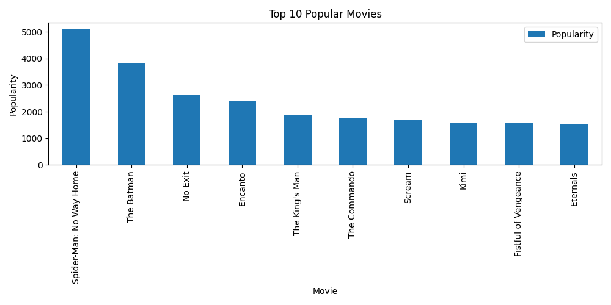
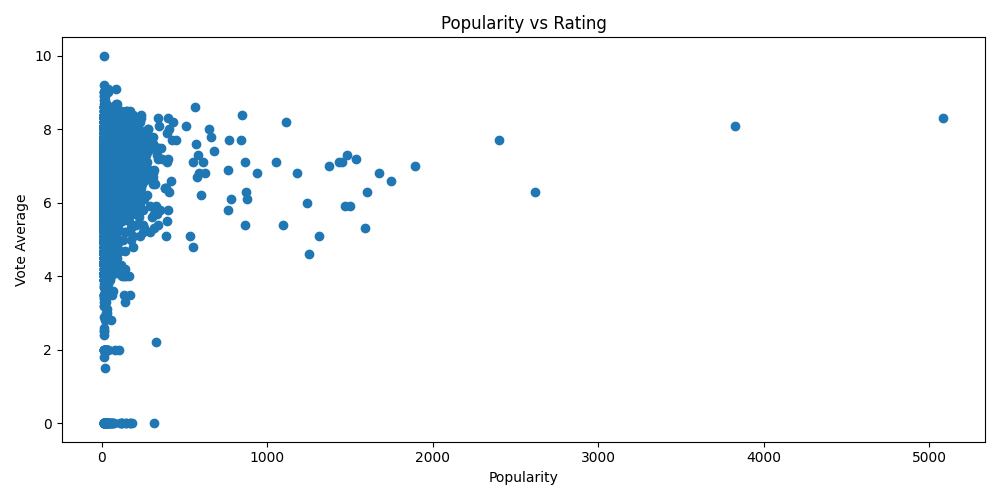
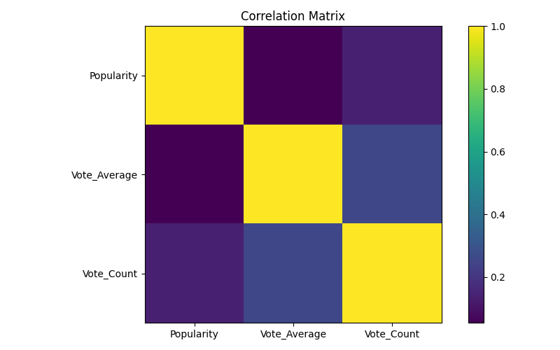
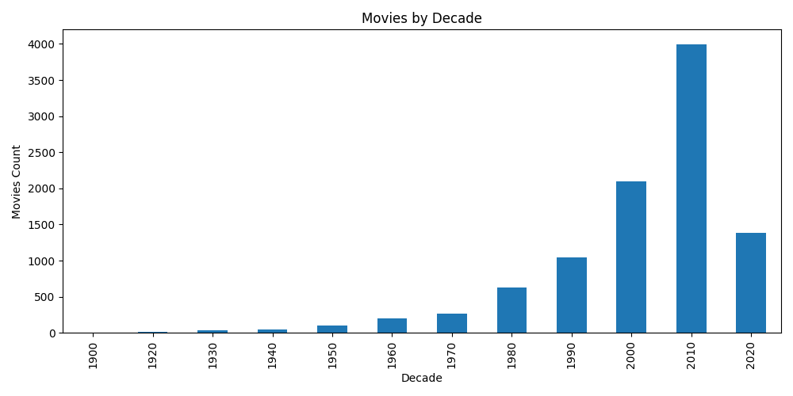

# Movie Analysis Project

## Overview

This project analyzes a movie dataset using Python, Pandas, and Matplotlib.  
It focuses on movie popularity, ratings, vote count, language distribution, genre trends, yearly release patterns, and correlation analysis.

The project demonstrates a complete beginner-to-intermediate level Exploratory Data Analysis workflow.

---

## Project Structure

* `data/` → movie dataset CSV file and cleaned dataset
* `visuals/` → saved graphs and charts
* `analysis.py` → main analysis script
* `insights.txt` → key findings
* `README.md` → project documentation
* `requirements.txt` → required libraries

---

## Data Cleaning Performed

* Missing values removed using `dropna()`
* Numeric columns converted using `pd.to_numeric()`
* Release date converted using `pd.to_datetime()`
* Year column created from release date
* Decade column created for long-term trend analysis
* Cleaned dataset exported as CSV

---

## Project Features

- Movie release trend analysis
- Top popular movies analysis
- Highest rated movies analysis
- Most voted movies analysis
- Language distribution analysis
- Genre frequency analysis
- Popularity and rating distribution
- Popularity vs rating relationship
- Correlation analysis
- Decade-wise movie analysis
- 25 saved visualizations using Matplotlib

---

## Analysis Performed

* Movies released per year
* Top 10 popular movies
* Highest rated movies
* Most voted movies
* Language distribution
* Genre frequency
* Average rating by language
* High-rated movies
* Movies after 2020
* Most common genres
* Movies count by language
* Top genres by popularity
* Correlation between popularity, rating, and vote count
* Movies by decade
* Yearly popularity trend

---

## Visualizations

* Line charts for yearly trends
* Bar charts for top movies, languages, and genres
* Pie charts for language and genre contribution
* Histograms for popularity and rating distribution
* Scatter plot for popularity vs rating
* Boxplots for rating and popularity spread
* Correlation matrix visualization

---

## Key Insights

* Movie releases show clear time-based trends.
* Popularity and rating are different success indicators.
* Highly popular movies do not always have the highest ratings.
* English movies are strongly represented in the dataset.
* Genre analysis helps identify dominant content categories.
* Vote count indicates audience engagement.
* Decade analysis gives a long-term view of movie production.
* Correlation analysis helps compare popularity, vote count, and rating.

---

## Sample Visualizations

### Movies Released Per Year

---

### Top Popular Movies

---

### Popularity vs Rating

---

### Correlation Matrix

---

### Movies by Decade

---

## Tools Used

* Python
* Pandas
* Matplotlib

---

## Outcome

This project demonstrates practical usage of:

- Data Cleaning
- Missing Value Handling
- Data Type Conversion
- Datetime Handling
- GroupBy Analysis
- Sorting
- Value Counts
- Correlation Analysis
- Data Visualization
- EDA Insight Generation
- GitHub Project Documentation

It forms a strong movie analytics workflow using Pandas and Matplotlib.

---

## Author

**Mehul Sharma**  
Aspiring Data Scientist