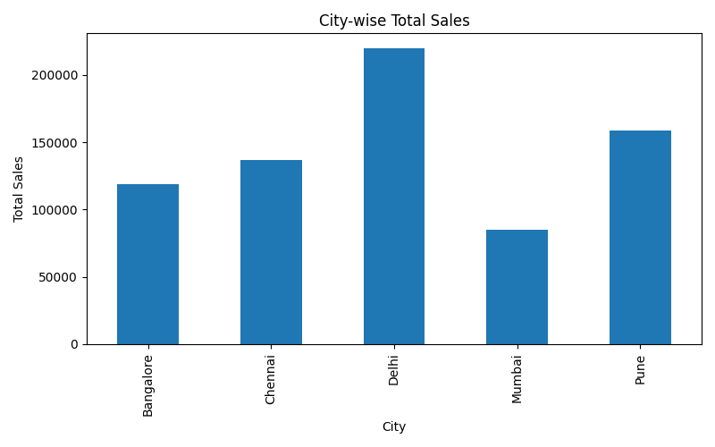
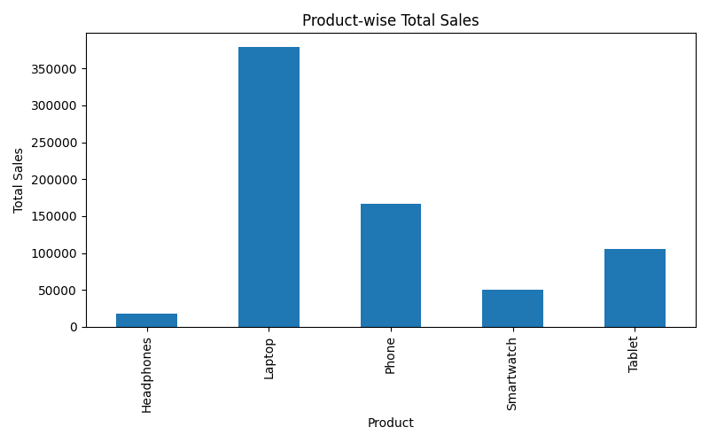
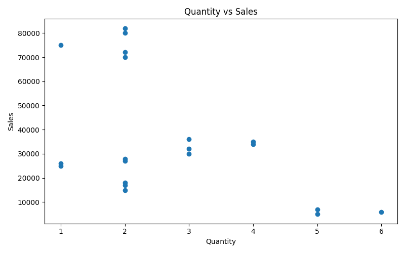
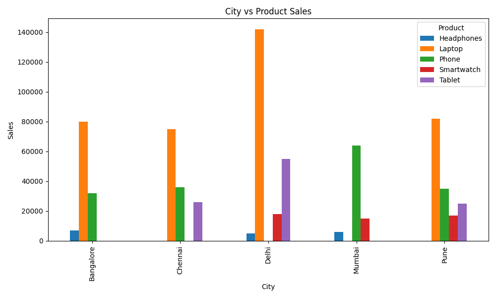

# Sales Analysis Project

## Overview

This project analyzes electronics sales data using Python, Pandas, and Matplotlib.  
It focuses on business-level sales analysis including city-wise sales, product performance, category performance, payment mode analysis, and visualization generation.

The project demonstrates a complete beginner-to-intermediate level data analytics workflow.

---

## Project Structure

* `data/` → sales dataset CSV file
* `visuals/` → saved graphs and charts
* `analysis.py` → main analysis script
* `insights.txt` → key business findings
* `README.md` → project documentation

---

## Project Features

- Real-world electronics sales dataset analysis
- City-wise sales analysis
- Product-wise sales analysis
- Category-wise revenue analysis
- Payment mode analysis
- Quantity and sales relationship analysis
- Pivot table based summary analysis
- Data visualization using Matplotlib
- Business insight generation
- Professional GitHub project structure

---

## Analysis Performed

* City-wise total sales
* Product-wise total sales
* Average sales by city
* Quantity sold by product
* Payment mode sales analysis
* Category-wise total sales
* Top sales orders analysis
* Product-wise average sales
* City-wise total quantity
* City vs Product sales comparison

---

## Visualizations

* Bar charts for city-wise and product-wise sales
* Pie chart for payment mode sales
* Line chart for average sales by city
* Scatter plot for Quantity vs Sales
* Grouped bar chart for City vs Product sales
* Category-wise revenue charts

---

## Key Insights

* Delhi and Mumbai show strong sales performance.
* Laptops generate high revenue due to higher product price.
* Mobiles show strong demand across multiple cities.
* Computers and Mobiles are strong revenue-generating categories.
* Higher quantity does not always mean higher revenue.
* Payment mode analysis helps understand customer transaction preferences.
* City-wise product comparison helps identify regional demand patterns.

---

## Sample Visualizations

### City-wise Total Sales

---

### Product-wise Total Sales

---

### Quantity vs Sales

---

### City vs Product Sales

---

## Tools Used

* Python
* Pandas
* Matplotlib

---

## Outcome

This project demonstrates practical usage of:

- Data Analysis
- GroupBy
- Aggregation
- Pivot Table
- Sorting
- Data Visualization
- Business Insight Generation
- GitHub Project Documentation

It forms a complete sales analytics workflow using Pandas and Matplotlib.

---

## Author

**Mehul Sharma**  
Aspiring Data Scientist