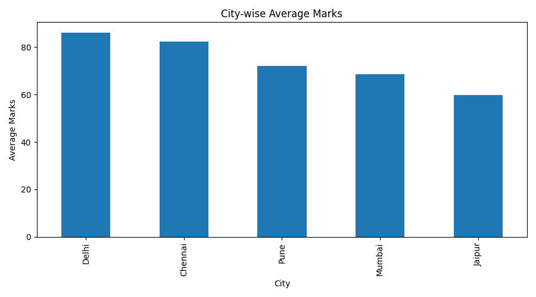
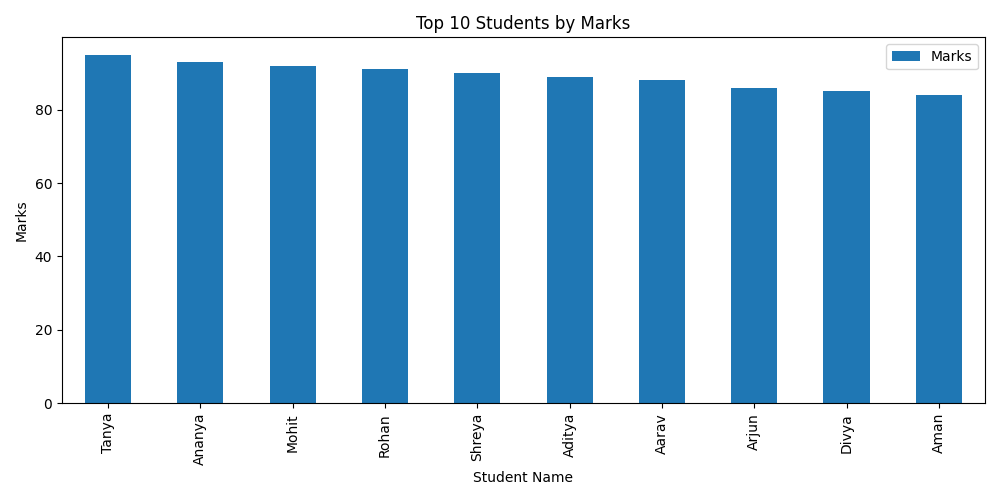
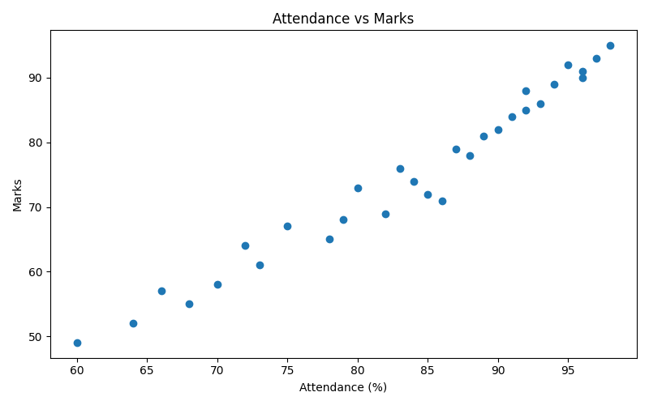
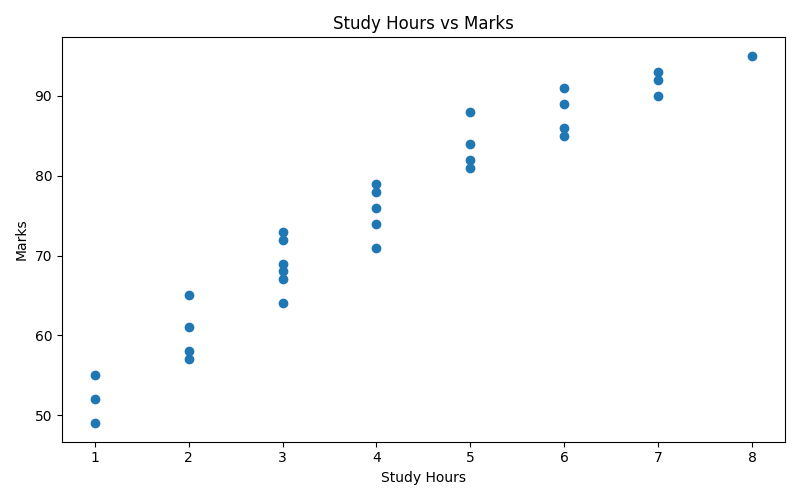
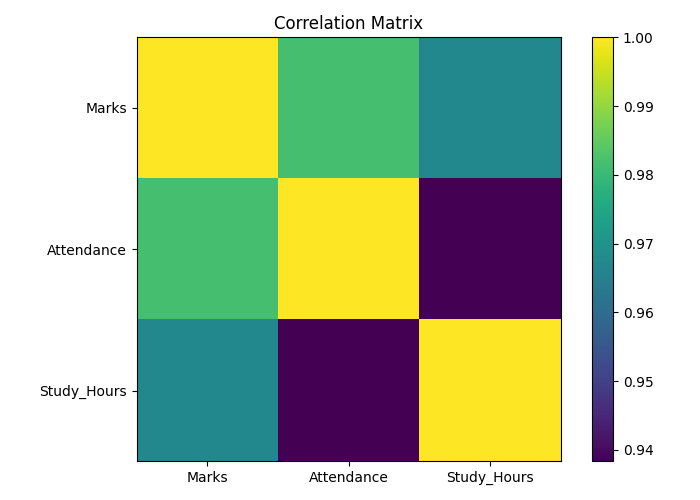

# Student Performance Analysis Project

## Overview

This project analyzes an upgraded student performance dataset using Python, Pandas, and Matplotlib.  
It includes data creation, CSV export, cleaning, feature engineering, groupby analysis, pivot tables, correlation analysis, visualizations, and insight generation.

The project demonstrates a stronger beginner-to-intermediate level EDA workflow.

---

## Project Structure

* `data/` → raw and cleaned student datasets
* `visuals/` → saved graphs and charts
* `analysis.py` → main analysis script
* `insights.txt` → key findings
* `README.md` → project documentation
* `requirements.txt` → required libraries

---

## Data Cleaning Performed

* Missing value handling using `dropna()`
* Numeric conversion using `pd.to_numeric()`
* Cleaned dataset exported as CSV
* Performance categories created using `apply()`
* Marks ranges created using `pd.cut()`
* Age groups created using `lambda`

---

## Project Features

- Upgraded dataset with 30 students
- City-wise performance analysis
- Subject-wise performance analysis
- Gender-wise performance comparison
- Attendance vs Marks analysis
- Study Hours vs Marks analysis
- Performance category classification
- Marks range distribution
- Pivot table based analysis
- Correlation analysis
- 16 saved visualizations using Matplotlib
- Business-style insight generation

---

## Analysis Performed

* Overall topper identification
* Top 10 students analysis
* City-wise average marks
* City-wise total marks
* City-wise student count
* Subject-wise average marks
* Subject-wise student count
* Gender-wise average marks
* Age group-wise performance
* Attendance vs Marks relationship
* Study Hours vs Marks relationship
* Performance category distribution
* Marks range distribution
* City vs Subject pivot analysis
* Correlation analysis

---

## Visualizations

* Bar charts for city, subject, gender, and category analysis
* Scatter plots for Attendance vs Marks and Study Hours vs Marks
* Histogram with mean line for marks distribution
* Pivot-based grouped bar chart
* Correlation matrix style visualization

---

## Key Insights

* Tanya scored the highest marks with 95 marks.
* Delhi has the highest average marks.
* Jaipur has the lowest average marks.
* Pandas has the highest subject-wise average marks.
* SQL has the lowest subject-wise average marks.
* Attendance and study hours help understand student performance patterns.
* Performance categories help identify Excellent, Good, Average, and Poor students.
* Marks range analysis helps understand score distribution.
* Correlation analysis helps compare Marks, Attendance, and Study Hours.

---

## Sample Visualizations

### City-wise Average Marks

---

### Top 10 Students

---

### Attendance vs Marks

---

### Study Hours vs Marks

---

### Correlation Matrix

---

## Tools Used

* Python
* Pandas
* Matplotlib

---

## Outcome

This upgraded project demonstrates practical usage of:

- Data Creation
- CSV Export
- Data Cleaning
- Feature Engineering
- GroupBy Analysis
- Aggregation
- Pivot Tables
- Correlation Analysis
- Data Visualization
- EDA Insight Generation
- GitHub Project Documentation

It forms a stronger student performance analytics workflow using Pandas and Matplotlib.

---

## Author

**Mehul Sharma**  
Aspiring Data Scientist