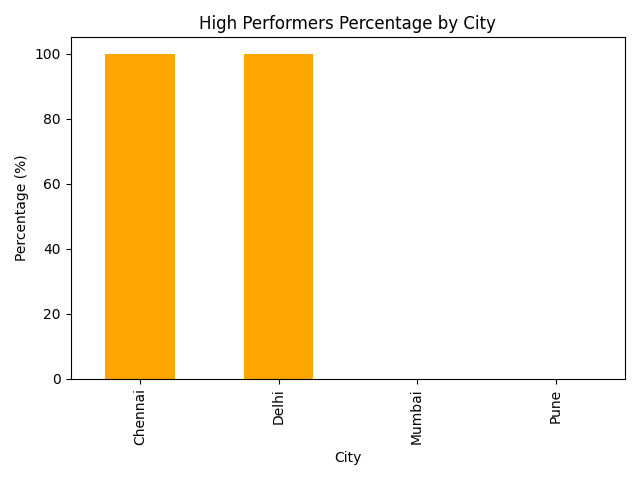
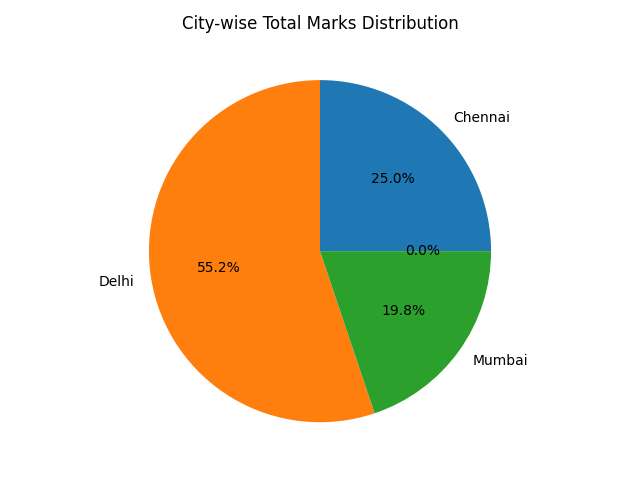
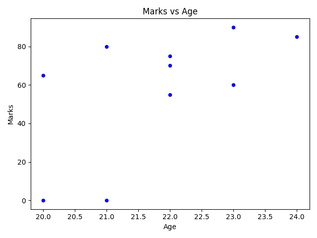

#  Student Performance Analysis Project

##  Overview

This project analyzes student performance using Python, Pandas, and Matplotlib. It includes data cleaning, analysis, visualizations, and insights generation.

---

##  Project Structure

* `data/` → dataset (CSV file)
* `visuals/` → saved graphs
* `analysis.py` → main analysis script
* `insights.txt` → key findings

---

##  Analysis Performed

* Topper identification
* City-wise performance analysis
* High performers percentage
* Age vs Marks relationship
* Performance category classification
* Marks distribution using bins

---

##  Visualizations

* Bar charts (comparison & categories)
* Pie chart (city contribution)
* Scatter plot (Age vs Marks)
* Histogram (distribution + mean line)
* Multi-metric comparison graphs

---

##  Key Insights

* Delhi shows strong performance across metrics
* Some cities have low high-performer percentage
* Marks are mostly concentrated in mid-range
* No strong correlation between age and marks
* Performance varies significantly across cities

---

##  Sample Visualizations

---

##  Tools Used

* Python
* Pandas
* Matplotlib

---

##  Outcome

This project demonstrates data cleaning, analysis, visualization, and insight generation — forming a complete beginner-level data analytics workflow.
